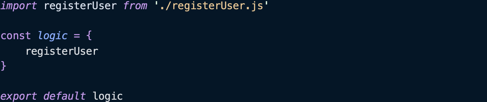
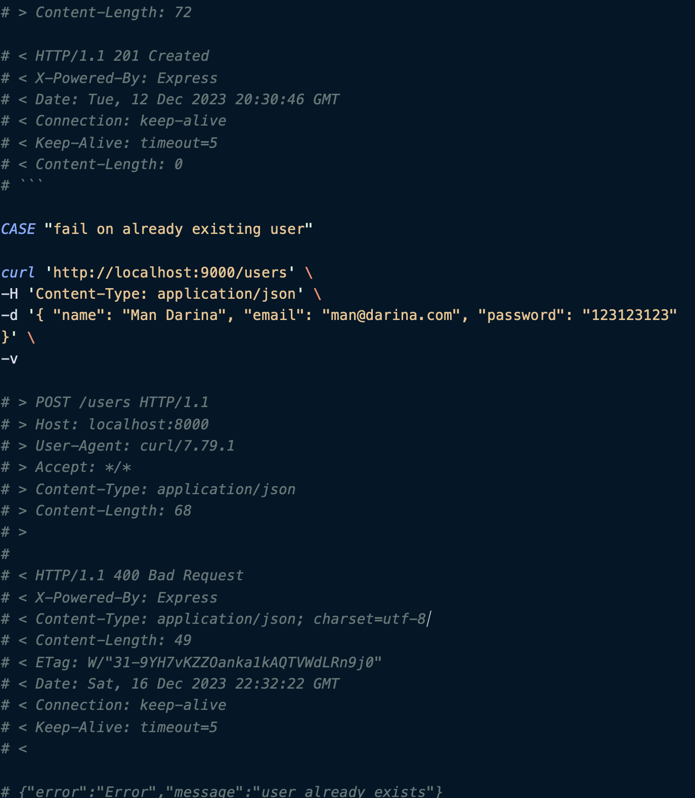

## Guia de Configuración y Desarrollo de Proyectos Node.js con Express y Mongoose

### **[00] PREPARAR ENTORNO**

Vamos a tener 3 carpetas principales en nuestro proyecto: **api / app / com** . La carpeta **com** será una carpeta compartida en la que tendremos cosas que usen tanto **api** como **app** (como errors y validate). Crearemos también **index.js** dentro de la carpeta **com** para indexar errors y validate y hacer que sea el archivo principal de esta carpeta. 

Podemos crear las carpetas **api** y **com**, pero no crearemos **app** (ya que Vite nos la creará, en el apartado de configuración de App, lo veremos)

### **[01] PREPARAR API. INSTALAR NODE Y LIBRERIAS** 

Instalamos node en nuestra Api. Como ya tenemos instalado node, sólo tendremos que inicializarlo con el comando **npm init –yes** en la carpeta que queramos, en mi caso será en /**api**.

#### <u>**[01.01] INSTALAR EXPRESS**</u>

Facilita la creación de servidores web en Node.js. Permite manejar con facilidad solicitudes HTTP mediante el uso de middleware y rutas.

Para instalar Express ponemos hacer **npm install express** o bien **pnpm i express** la diferencia en hacerlo de una manera o de otra es que con npm nos descargamos todas las carpetas y con pnpm la ruta a las carpetas. 

Para instalar este paquete, lo tenemos que hacer a través de la consola de VSCODE y estar en la carpeta en la que queremos instalarlo. En este caso en /**api**

#### <u>**[01.02] INSTALAR MONGOOSE**</u>

Mongoose será nuestra base de datos. Para instalarlo repetimos el proceso anterior. Hacemos bien **pnpm i express**  en la carpeta /**api**.

#### <u>**[01.03] INSTALAR DOTENV**</u>

Dotenv es un módulo que carga variables de entorno desde un archivo **.env** a **process.env** que facilita la configuración del entorno. Para instalar este módulo tenemos:

- Crear el archivo **.env** Nos situamos en /**api** y usamos el comando  **touch .env** esto nos creará el archivo **.env**

- Añadir el archivo **.gitignore** y añadir que no ignore el archivo **.env** que acabamos de crear. Para eso hacemos un **touch .gitignore** desde /**api**. Se nos crea el archivo y dentro del archivo escribimos **!.env**

- Añadimos al archivo **.env** las rutas que queramos, en mi caso:

 **MONGODB\_URL = mongodb://127.0.0.1:27017/project**

  **TEST\_MONGODB\_URL = mongodb://127.0.0.1:27017/test**

  **PORT = 9000**

 **JWT\_SECRET = me gustan las patatas fritas**

 **JWT\_EXP = 1h**

Hay algunas que aún no hemos instalado (como las de jasonWebToken pero las ponemos para más adelante).

#### <u>**[01.04] INSTALAR MOCHA CHAI**</u>

Mocha y Chai son dos bibliotecas de JavaScript que se usan para hacer testing. Se complementan entre sí para para ofrecer una solución completa para escribir y ejecutar pruebas tanto en aplicaciones del lado del servidor como del cliente.

Mocha es un test framework que se ejecuta en Node.js y en el navegador. Mocha proporciona la estructura para hacer pruebas. Chai es una biblioteca de aserciones paraNode.js y el navegador que se empareja con Mocha. Ofrece varias interfaces que permiten escribir aserciones de prueba de manera más expresiva y legible. Las interficies más comunes son ‘expect’, ‘should’ y ‘assert’.

Para instalar mocha chai en nuestro proyecto, tenemos que poner **pnpm i -D mocha chai** en la terminal de vscode, tenemos que situarnos en la carpeta donde lo queramos instalar, en este caso en /**api**. 

Tendremos que modificar el **package.json** de /**api** para añadirle scripts de mocha chai

 **"test-inspect": "mocha --inspect-brk logic/\*.spec.js",**

 **"test-coverage": "nyc --reporter=text-summary --reporter=html mocha --require esm logic/\*.spec.js"**

#### <u>**[01.05] TRABAJAR CON ESM “MODULOS” IMPORTS Y EXPORTS**</u>

ESM (ECMAScript Modules) es el estándar oficial en JS para trabajar con módulos. Introduce dos operaciones principales: ‘import’ y ‘export’. Hay dos tipos principales de exportaciones: 

- nombradas 

**export const miVariable = 123**

**export function miFuncion() { ... }**

- por defecto

**export default function() { ...**

Hay dos tipos principales de importaciones, también las nombradas y por defecto.

**import { miVariable, miFuncion } from './miModulo.js'**

**import MiFuncionDefault from './miModulo.js'**

Para indicar que vamos a trabaja con ESM tenemos que ir a **package.json** y poner lo siguiente:

**"type": "module"**

De manera que el **package.json** quedará así:

*< No está explicado pero la parte de los scripts lo añadimos manualmente como atajos. En consola en vez de poner  **node –inspect-brk** . si queremos debuggear, podemos poner **npm run inspect** y es lo mismo, pero más corto. />*

#### <u>**[01.06] INSTALAR BCRYPT // PROTEGER CONTRASEÑAS** </u>

Usamos la librería  **bcrypt**. Para instalar esta librería, tenemos que estar en la carpeta donde lo queramos instalar, en mi caso /**api** y en la terminal poner  **pnpm i bcryptjs**

#### <u>**[01.07] CONVERTIR COM EN UN PAQUETE DE NODE** </u>

Tenemos que convertir la carpeta  **com** en un paquete de node para poder compartirla entre  **app** y  **api**. Para inicializar el paquete de node, tenemos que situarnos en /**com** y ejecutar el comando **npm init –yes**

Esto nos crea un **package.json** en /**com**. Añadimos el tipo. /**api**"type": "module"**

Ahora lo tenemos que instalar en **api** para que sea accesible desde ahí. Nos situamos en /**api** y ponemos el comando **pnpm i ../com** le estamos diciendo instálame el módulo de la carpeta superior.

Vemos como el **package.json** de /**api** se ha instalado **‘com’** como un link

#### <u>**[01.08] INSTALAR JSONWEBTOKEN** </u>

Usamos la librería  **jsonwebtoken**. Para instalar esta librería, tenemos que estar en la carpeta donde lo queramos instalar, en mi caso /**api** y en la terminal poner  **pnpm i jsonwebtoken**

Un JWT se compone de 3 partes:

- Header: consiste en 2 partes (el tipo de token y el algortmo de firma utilizado).

- Payload: contiene las declaraciones, que son afirmaciones sobre una entidad y dato adicionales.

- Signature: para crear la firma, se tiene que coger el encoded header, el encoded payload, se unen con un punto y se frma con el algoritmo especificado en el header y usando la clave secreta.

### **[02] COMPROBAR QUE LA API FUNCIONA**  

Con la lógica de **RegisterUser** vamos a comprobar que Api funciona bien. 

####  <u>**[02.01] LÓGICA DE REGISTERUSER / REGISTERUSER.TEST / ARCHIVOS AUXILIARES**</u>

En **api** vamos a tener 2 carpetas: **logic** y **data**. Dentro de data tenemos un archivo **models.js** en el que tenemos lo siguiente

`	`/**api/data/models**

De momento en **logic** tenemos el archivo **registerUser.js** y **registerUser.test.js** 

`	`**/api/logic/registerUser.js**

`	`**/api/logic/registerUser.test.js**

Necesitaremos la carpeta  **com**  para validar e importar los errores en nuestra lógica. Dentro de esta carpeta tenemos  **errors** , **validate**  y un  **index**  que indexa. 

`	`**/com/errors.js**

`	`**/com/validate.js**

`	`**/com/index.js**

 

####  <u>**[02.02] EJECUTAR EL TEST REGISTERUSER.TEST EN CONSOLA**</u>

Una vez tenemos todos los archivos, ejecutamos **registerUser.test**. Para hacer esto, tenemos que situarnos en **/api** y poner el siguiente comando:

🔥 api % **node logic/registerUser.test.js**

*user registered*

Nos tiene que aparecer que el usuario se ha registrado. 

####  <u>**[02.03] COMPROBAR QUE LA BASE DE DATOS EN MONGO SE HA ACTUALIZADO** </u>

Ahora comprobamos que la base de datos de **mongo**  se haya incorporado este usuario.

 

####  <u>**[02.04] AÑADIR EL HANDLER DE REGISTERUSER** </u>

Creamos en la carpeta **/api/handlers** el archivo **registerUserHandler.js**

**/api/handlers/registerUserHandler.js** 

 

####  <u>**[02.05] AÑADIR INDEX EN HANDLERS** </u>

Necesitamos crear un indexador en handlers para exportar todos los handlers a la vez, a este indexador le llamamos **index.js**
. De momento sólo tenemos un handler, pero a medida que vayamos haciendo más lógicas y sus tests, los incorporaremos. 

**/api/handlers/index.js** 

 

####  <u>**[02.06] AÑADIR INDEX EN LOGIC** </u>

Si nos fijamos en **registerUserHandler**
, la importación de las lógicas la hacemos de la siguiente manera: 

 

Esto indica que tenemos un indexador en logic, en el que importamos/exportamos todas las lógicas que vayamos creando. Vamos a hacer ese indexador. Como en otras ocasiones, se llama index

**/api/logic/index.js** 

 

Como con el indexador de handler, a medida que vayamos creando lógicas, las añadiremos a este **index** para exportarlas y poder trabajar con ellas. 

####  <u>**[02.07] CREACIÓN CARPETA TEST**</u>

Crearemos una carpeta llamada **test** en la que tendremos archivos **.sh** 

Los archivos de prueba .sh son opcionales. Pero como son rápidos de implementar y te permiten ver rápidamente si la conexión va bien, los usaremos. 

Creamos la carpeta **test** en la ruta **/api/test** 

Esta carpeta tendrá un archivo llamado **pepetest.sh** (opcional, es para dar estilo) y los archivos de prueba de las lógicas. Empezaremos por **register-user.test.sh**

 **/api/test/pepetest.sh** 

 

 **/api/test/registerUser.test.sh** 

 

 

####  <u>**[02.08] CREACIÓN INDEX EN API**</u>

Necesitamos un archivo **index** en  **/api** . 

 

Qué hace este bloque de código? Configuramos y arrancamos un servidor web. 

Nos conectamos a la base de datos de Mongo. 

Configuramos el servidor web con express.

Definimos la ruta raíz 

 

La ruta raíz es **/** para el servidor y este responde con un Hello World cuando accedemos a esta ruta mediante una solicitud GET . Así verificamos que el servidor funciona bien. 

Aplicamos el middleware cors al servidor, lo que permite que nuestra **api** acepte solicitudes de origen cruzado.

Inicializamos un middleware (**jsonBodyParser**) que analiza el cuerpo de las solicitudes entrantes en formato JSON, facilitando el acceso a estos datos. 

Inicializamos el servidor

 

A medida que tengamos más lógicas, tendremos que añadirlas. De momento, sólo tenemos  register. 

**/api/index**

 

####  <u>**[02.09] COMPROBACIÓN DE QUE EL TEST REGISTER-USER.TEST.SH FUNCIONA**</u>

Para comprobar que **register-user.test.sh** funciona bien, necesitaremos tener 2 terminales abiertas.

Nos situamos en **/api** y ponemos  **node .**

🔥 api % **node .**

*server running on port 9000*

Nos tiene que aparecer el mensaje de que el servidor ha arrancado bien. Ahora abrimos otra terminal, pero nos tenemos que situar en test **/api/test**  y ejecutamos **./register-user.test.sh**

 

Parece que ha ido bien, pero tenemos que comprobar que realmente el nuevo usuario se encuentre en la base de datos de mongo.

*< me ha pasado que al intentar ejecutar **./register-user.test.sh** me ha salido un error de permisos, lo he solucionado con el siguiente comando **chmod +x ./register-user.test.sh**. />*

####  <u>**[02.10] COMPROBACIÓN EN LA BASE DE DATOS QUE SE HA REGISTRADO BIEN EL USUARIO**</u>

Vamos a la terminal de **mongo** (nos aseguramos que estamos en la base de datos correcta, para cambiarla ponemos **use project**).

 

###  <u>**[03] TESTEAR CON SPEC** </u>

Lo último que nos queda para comprobar que nuestra **api** funciona bien es hacer las pruebas con los tests más avanzados, los **spec**. Los spec los crearemos en la carpeta **/api/logic** De manera que esta carpeta tendremos las lógicas y sus specs. 

####  <u>**[03.01] CREACIÓN REGISTERUSER.SPEC**</u>

 **/api/logic/registerUser.spec.js** 

 
 

####  <u>**[03.02] CREACION CARPETA HELPERS EN LOGIC**</u>

Si nos fijamos en el código del spec de **registerUser**, vemos que importa un archivo **random** de la carpeta **helpers**, pero no la hemos creado. Vamos a hacerlo! Creamos una carpeta llamada **helpers** en la siguiente ruta:  **/api/logic/helpers** y creamos el archivo **random.js**

`	` **/api/logic/helpers/random.js** 

 

####  <u>**[03.03] EJECUTAMOS REGISTERUSER.SPEC**</u>

Para ejecutar el test, tenemos que situarnos en **/api** y ejecutar el comando  **pnpm run test** 

 

Sólo nos queda comprobar que se han guardado loss cambios en la base de datos. Para eso nos cambiamos a test (porque yo uso la base de dato test para los spec y project para lo demás).

 

Y vemos como se ha creado un usuario random y todo es random! 